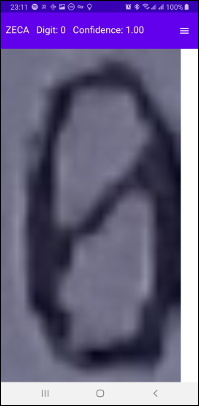
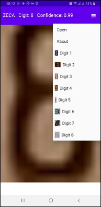

# ZECA - slashed Zero-Eight Classifier for Android

<!--- See https://shields.io for others or to customize this set of shields. --->


Slashed **Z**ero-**E**ight **C**lassifier for **A**ndroid (**ZECA**) is an
 application that demonstrates how to use **TensorFlow lite** (tflite) model to distinguish
  slashed zeroes from eights.

For the Python project used to train the model see: [**ZEC - Slashed Zero
-Eight Classifier**](https://github.com/trayanmomkov/zec)

## Motivation
I'm using Google ML Kit for Firebase in my
[ReCalc: Receipt Calculator](https://play.google.com/store/apps/details?id=info.trekto.receipts)
app but its accuracy
 on slashed zeroes is around 70%. I decided to train a model myself.

## Prerequisites
* [Android Studio](https://developer.android.com/studio/)
* Basic to intermediate knowledge of writing Android applications

## Using ZECA
* In Android Studio navigate to `File > New > Project from Version
 Control > Git` and paste `https://github.com/trayanmomkov/zeca.git`
* When you run the app on your mobile device you can use the
**sample images**
 from the menu or open one from your storage. The image must contain only
  one slashed
  zero or eight on a light background otherwise classifier cannot
   classify it correctly.
* When the classification finished you will see the predicted digit and
 confidence in the application header.

## Project structure
The heart of the project is the `classify` method in `Classifier`.
It uses previously created in the constructor `Interpreter` object to infer (predict).
TensorFlow lite model is also loaded in the constructor.

The other important class is the `ImagePreprocessor`. It prepares the
 image for inferring. All the manipulations are done in the
  exact same order for the images used to train the model. If you change
   any of these manipulations you should train the model again. If you
    want to do that use the model training project:
    [ZEC - Slashed Zero-Eight Classifier](https://github.com/trayanmomkov/zec).
    
The essential `MainActivity` method:
```
    /**
     * Preprocess image and classify it.
     * @param bitmap Image
     */
    private void processPhoto(Bitmap bitmap) {
        Classification classification = classifier.classify(
                normalize(
                        getPixelsValues(
                                convertToBlackAndWhiteCenteredImage(bitmap))));

        showClassification(classification);
        imageView.setImageBitmap(bitmap);
    }
```


## Contributing to ZECA
The project **goals** are:
 * To be an example of using tflite on Android
 * To solve the specific problem of distinguishing slashed zeroes from
  eights
  
 If you can help in making the code **smaller and simpler** you are
 welcome to contribute.
  
To do that, follow these steps:

1. Fork this repository.
2. Create a branch: `git checkout -b <branch_name>`.
3. Make your changes and commit them: `git commit -m '<commit_message>'`
4. Push to the original branch: `git push origin <project_name>/<location>`
5. Create the pull request.

Alternatively see the GitHub documentation on [creating a pull request](https://help.github.com/en/github/collaborating-with-issues-and-pull-requests/creating-a-pull-request).

## Contact
If you find an error, something looks incorrect or just have a suggestion please write me.


Trayan Momkov

## License
[Apache License 2.0](LICENSE)
